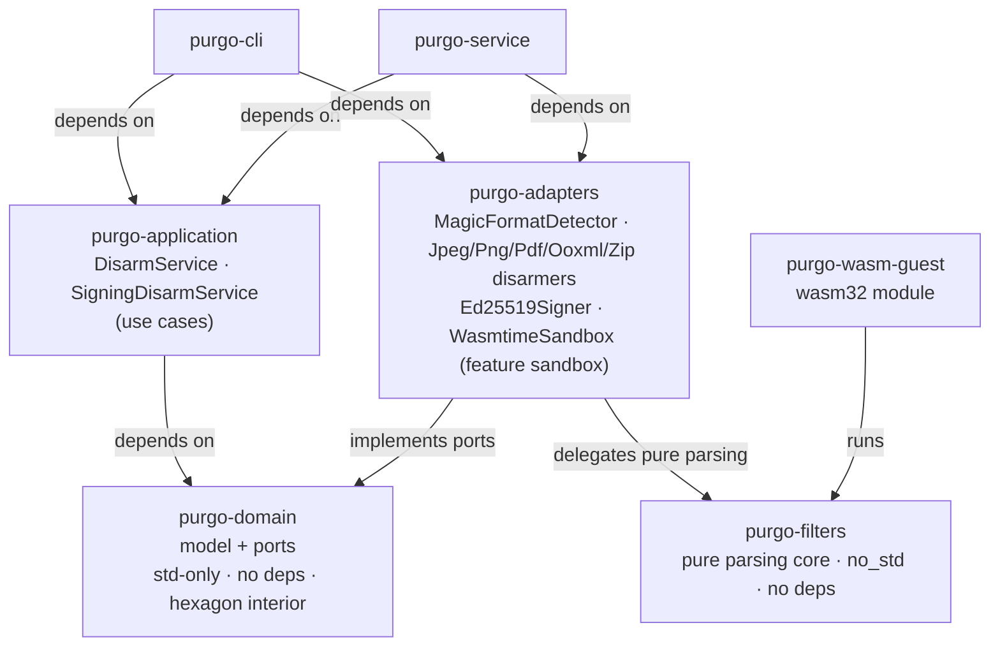

# purgo

> Rebuild untrusted files into safe ones — an open-source, auditable **CDR** (Content Disarm & Reconstruction) engine.

`purgo` neutralises a file that crosses a trust boundary (USB stick, upload, the "dirty" side of a diode) not by *scanning* it, but by **rebuilding** it from its legitimate parts only. That is the CDR approach: don't look for the bad, keep only the good.

Design goals:

- **Auditable** — for a disarmer, that is the whole point of open source: you only trust what you can read.
- **Safe** — Rust, `unsafe` forbidden workspace-wide (`unsafe_code = "forbid"`).
- **Extensible** — one format = one adapter, added without touching the rest (Open/Closed).

## Status (v0.1)

A working vertical slice. The **core** (domain, application, and the pure parsing core `purgo-filters`) has **no third-party dependencies** (`std`/`no_std` only); the **adapters** rely on small, focused libraries (`lopdf`, `zip`, `quick-xml`, `ed25519-dalek`, `rand_core`, and — behind the `sandbox` feature — `wasmtime`), and the HTTP service on `axum`/`tokio`:

- signature-based format detection (`MagicFormatDetector`);
- **JPEG** disarming: drops `APPn` segments (EXIF/XMP/ICC/thumbnails) and `COM` comments, optionally keeps JFIF, copies image data verbatim, and truncates any trailing bytes after `EOI`;
- **PNG** disarming: keeps an allow-list of critical chunks, drops ancillary chunks (`tEXt`, `zTXt`, `iTXt`, `eXIf`, …);
- **PDF** disarming (`lopdf`): removes automatic actions (`/OpenAction`, `/AA`), JavaScript (`/JavaScript`, `/JS`, the `/Names/JavaScript` tree), dangerous actions reached via `/A`/`/Next` **whether inline or as indirect objects** (`/Launch`, `/JavaScript`, `/GoToR`, `/URI`, `/SubmitForm`, `/ImportData`, `/Rendition` — classified by their `/S` subtype) and embedded files (`/Names/EmbeddedFiles`, `/EF`, `/EmbeddedFile`, `/Filespec`); pages and text are re-serialised; inline nesting beyond 64 levels is rejected fail-closed;
- **OOXML** disarming (`.docx`/`.xlsx`/`.pptx`, `zip` + `quick-xml`): rebuilds the ZIP archive, dropping VBA macro projects (`vbaProject.bin` under `word/`, `xl/` or `ppt/`, **by name**, even when no `.rels` references them), embedded OLE objects (`embeddings/`, `oleObject*`) and, in `.rels` parts, external (`TargetMode="External"`) and `oleObject`/`vbaProject` relationships; the detector recognises a ZIP carrying `[Content_Types].xml` as OOXML; a bare (non-OOXML) ZIP is explicitly refused (`ZipDisarmer`, fail-closed);
- **WASM isolation** (`WasmtimeSandbox`, behind the `sandbox` feature): parsing runs inside a WebAssembly module with **no imports** (no WASI, no host functions → no filesystem/network/clock access), bounded per call by a fuel (CPU) budget and `StoreLimits` (memory); the pure logic is shared with the in-process path through `purgo-filters` (PNG today), so the sandboxed output is identical to the in-process one;
- **output signing** (`Ed25519Signer`, pure-Rust `ed25519-dalek`): the `DisarmAndSign` use case disarms, then signs the clean bytes and exposes the public key; the detached Ed25519 signature is verifiable with that key;
- the `purgo` CLI produces the clean file plus a JSON audit report, and optionally a detached signature `<output>.sig` and public key `<output>.pub` (`--sign`).

## Architecture — hexagonal (ports & adapters)

See [docs/architecture.md](docs/architecture.md) for the detail. Source-code dependencies only ever point **inwards**, towards the domain:



- **purgo-domain** — business model + ports (traits). No I/O, no third-party dependency.
- **purgo-application** — the use cases (`DisarmService`, `SigningDisarmService`); orchestrates the domain through its ports, depends on traits only. No third-party dependency.
- **purgo-filters** — the pure parsing core (`no_std`, no deps), shared verbatim by the in-process adapter and the WASM guest (PNG today).
- **purgo-adapters** — concrete implementations of the outbound ports (JPEG/PDF/OOXML/ZIP parsing, Ed25519 signing, and the `wasmtime` sandbox behind the `sandbox` feature).
- **purgo-wasm-guest** — a `wasm32-unknown-unknown` module running `purgo-filters` inside the sandbox, with no imports.
- **purgo-cli** — driving adapter and **composition root** (the only place that knows the concrete adapters).
- **purgo-service** — the **HTTP** driving adapter (`axum` + `tokio`) and an additional **composition root**. The `purgo-serve` binary wires the same adapters as the CLI and exposes the `DisarmFile` use case over the network. Handlers only translate HTTP ⇄ use case (no business logic).

## Tests (pyramid)

| Level | Where | What |
|---|---|---|
| **Unit** | `#[cfg(test)]` in each crate | domain model, `DisarmService` with fakes, JPEG/PNG parsers, Ed25519 signing (sign then verify; tampered bytes rejected), argument parsing, JSON serialisation |
| **Integration** | `purgo-adapters/tests/`, `purgo-cli/tests/pipeline.rs`, `purgo-service/tests/http.rs` | real detector + disarmer; the application service wired to real adapters; a real `axum` Router driven via `tower::ServiceExt::oneshot` (no socket): `POST /disarm` of a JPEG/PDF/DOCX → payload absent from the body + report headers, fail-closed refusals (415 unsupported, 422 malformed, 413 body too large), `/health` = 200 |
| **Integration (sandbox)** | `purgo-adapters/tests/sandbox.rs` (feature `sandbox`, `make test-sandbox`) | PNG disarming really crosses the WASM guest and yields the **same** result as in-process; the guest module imports **nothing**; the CPU (fuel) bound interrupts an infinite-loop guest |
| **E2E** | `purgo-cli/tests/e2e.rs` | the **real `purgo` binary** on a temp file, checking the clean file, the report, the detached signature and the public key (`--sign` → `<output>.sig` + `<output>.pub`) |
| **Anti-panic** | `make fuzz-corpus` (CI) | replays the fuzz corpus on each parser: the call **never panics** (only `Ok`/`MalformedInput`) |

## Build & test

```sh
cargo test --workspace        # the whole pyramid (sandbox excluded: feature off by default)
make test-sandbox             # the WASM round-trip (feature `sandbox`, wasm32 target)
make fuzz-corpus              # replays the fuzz corpus (anti-panic invariant)
make lint                     # clippy -D warnings
make fmt-check                # rustfmt --check
cargo run -p purgo-cli -- photo.jpg -o photo.clean.jpg --report report.json
cargo run -p purgo-cli -- photo.jpg -o photo.clean.jpg --sign key.bin   # writes .sig + .pub

# HTTP service mode (binds 127.0.0.1:9090 by default, configurable via PURGO_BIND)
PURGO_BIND=127.0.0.1:9090 cargo run -p purgo-service --bin purgo-serve
curl -sS --data-binary @photo.jpg http://127.0.0.1:9090/disarm -o photo.clean.jpg -D headers.txt
#   → body = clean file ; headers X-Purgo-Format / X-Purgo-Removed-Count /
#     X-Purgo-Original-Size / X-Purgo-Sanitized-Size / X-Purgo-Modified
curl -sS http://127.0.0.1:9090/health        # → 200
```

All build commands also run through the containerised `./x` wrapper (Docker image
with the stable + nightly toolchains, `cargo-fuzz` and the wasm32 target), so
nothing is installed on the host — e.g. `./x cargo test --workspace`.

## Fuzzing

Parsers are the attack surface: they read hostile bytes. The `fuzz/` crate
(separate from the main workspace, isolated by `cargo-fuzz`) exposes one
[`cargo-fuzz`](https://github.com/rust-fuzz/cargo-fuzz) target per real disarmer
(`jpeg`, `png`, `pdf`, `ooxml`). Each target runs the disarmer on arbitrary bytes
and checks the **invariant**: the call **never panics** — only `Ok(_)` or
`Err(DomainError::MalformedInput { .. })` (fail-closed rejection) are accepted.

Fuzzing needs the nightly toolchain and `cargo-fuzz`; everything goes through the
containerised `./x` wrapper (nothing installed on the host):

```sh
./x cargo +nightly fuzz list                  # jpeg, ooxml, pdf, png
./x cargo +nightly fuzz build                 # build all targets

# Bounded smoke run of a target (≈ what CI runs):
./x cargo +nightly fuzz run jpeg  -- -runs=100000 -max_total_time=40
./x cargo +nightly fuzz run png   -- -runs=100000 -max_total_time=40
./x cargo +nightly fuzz run pdf   -- -runs=100000 -max_total_time=40
./x cargo +nightly fuzz run ooxml -- -runs=100000 -max_total_time=40

# Longer campaign: drop -runs and raise -max_total_time.
```

A crash is written to `fuzz/artifacts/<target>/` and **replayed** immediately with
`./x cargo +nightly fuzz run <target> fuzz/artifacts/<target>/<id>`. The corpus
(`fuzz/corpus/`), crash artifacts and build output (`fuzz/target/`) are generated
and not versioned (`.gitignore`).

## Future work

- Extract the JPEG/PDF/OOXML parsing into `purgo-filters` so they can also run inside the WASM sandbox (only PNG does today).
- A longer fuzzing campaign and a versioned corpus of crafted files.
- A signed audit log (today only the clean output is signed).
- A USB appliance mode.

## Author

Tanguy Chénier

## License

[EUPL-1.2](https://eupl.eu/).
