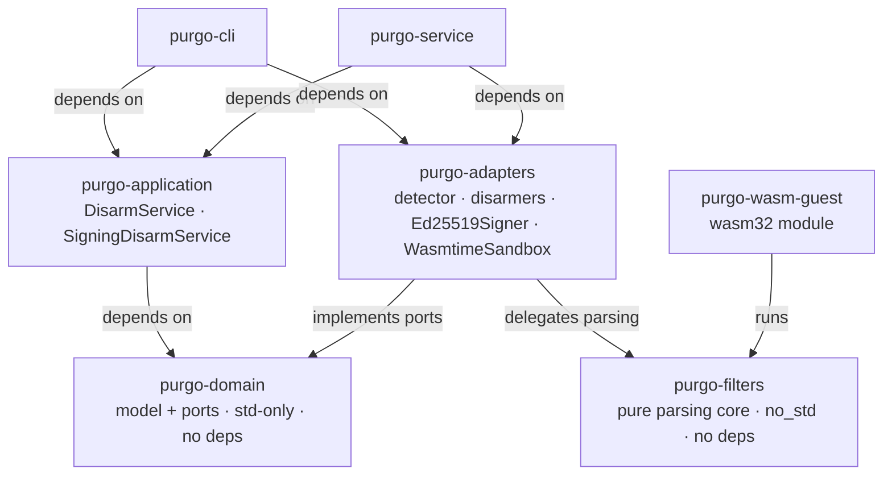

# Architecture

`purgo` is built as a **hexagon (ports & adapters)** and follows the
**clean-architecture dependency rule**: source-code dependencies only ever
point *inwards*, towards the domain. The domain knows nothing about the
outside world; the outside world depends on the domain.

## The crates and their direction of dependency

Every crate depends on the domain; the domain depends on nothing.

* **purgo-domain** — the interior of the hexagon. Entities and value objects
  (`Artifact`, `CleanArtifact`, `FileFormat`, `Policy`, `DisarmReport`,
  `DisarmReceipt`, `SignedReceipt`, `Signature`, `PublicKey`), the error type,
  and the **ports** (traits). No I/O, no third-party dependency: it cannot tell
  disk from socket from USB stick.
* **purgo-application** — the use-case layer. `DisarmService` implements the
  inbound port `DisarmFile` by orchestrating the outbound ports
  (`FormatDetector`, `Disarmer`); `SigningDisarmService` implements
  `DisarmAndSign` by composing a `DisarmFile` with a `Signer` (disarm, then sign
  the clean bytes, then expose the public key). Depends on the domain traits
  only — no third-party dependency.
* **purgo-filters** — the **pure, `no_std` parsing core** shared by the
  in-process adapter and the WASM guest so the dangerous, attacker-facing
  parsing has a single audited implementation. Today it holds the PNG filter and
  the host/guest wire protocol; JPEG/PDF/OOXML still parse inline in the adapters
  (see *Sharing the parsing core* below). No domain types, no I/O, no deps.
* **purgo-adapters** — concrete implementations of the outbound ports
  (`MagicFormatDetector`, `JpegDisarmer`, `PngDisarmer`, `PdfDisarmer`,
  `OoxmlDisarmer`, `ZipDisarmer`, `Ed25519Signer`, and, behind the `sandbox`
  feature, the `wasmtime`-backed `WasmtimeSandbox` plus the `SandboxDisarmer`
  glue that adapts a `Sandbox` into a `Disarmer`).
* **purgo-wasm-guest** — a `wasm32-unknown-unknown` cdylib that runs
  `purgo-filters` behind a thin linear-memory ABI, instantiated by the host with
  **no imports** (no WASI, no host functions).
* **purgo-cli** — a driving adapter and a **composition root**: names concrete
  adapters and wires them into the use cases.
* **purgo-service** — the **HTTP** driving adapter (`axum` + `tokio`) and a
  second **composition root** (`bin/purgo-serve.rs`), wiring the same adapters as
  the CLI and exposing `DisarmFile` over `POST /disarm`. Handlers only translate
  HTTP ⇄ use case.

## Ports

* **Inbound (driving)** — `DisarmFile` (disarm and report) and `DisarmAndSign`
  (disarm, then attest the clean bytes): what the application offers. The CLI,
  the HTTP service, and tests all drive *these traits*, never the concrete
  services.
* **Outbound (driven)** — `FormatDetector`, `Disarmer`, `Sandbox` and `Signer`:
  what the application needs from the world. Adapters provide them. `Sandbox`
  (WASM isolation) and `Signer` (Ed25519) are **implemented and wired today**,
  not future work.

## How SOLID shows up

* **S**ingle Responsibility — one disarmer per format; detection, orchestration
  and reporting live in distinct units.
* **O**pen/Closed — a new format is a new `Disarmer` implementor plus one line
  in the composition root. `DisarmService` never changes.
* **L**iskov — every `Disarmer` honours the same contract: valid input →
  `DisarmOutput`; hostile input → `MalformedInput`, never a panic.
* **I**nterface Segregation — small, focused ports (`FormatDetector`,
  `Disarmer`) instead of one fat "engine" interface.
* **D**ependency Inversion — `DisarmService` depends on the port *traits*; the
  concrete adapters depend on the domain. Wiring happens at the edge
  (composition root), so the core is testable with in-memory fakes.

## Adding a new format (worked example)

1. Add the variant to `FileFormat` (in `purgo-domain`) and teach
   `MagicFormatDetector` its signature.
2. Put the dangerous structural parsing in **`purgo-filters`** (pure, `no_std`,
   no panics on hostile input) when you want it to run identically in-process and
   inside the WASM sandbox — this is how PNG is done, so the same audited code
   serves both the adapter and the guest. (JPEG/PDF/OOXML currently parse inline
   in their adapters; share them through `purgo-filters` to put them in the
   sandbox too.)
3. Create an adapter, e.g. `purgo-adapters/src/disarm/pdf.rs`, implementing
   `Disarmer` for `FileFormat::Pdf` (delegating to `purgo-filters` when shared).
4. Register it in **every** composition root that should accept it
   (`purgo-cli/src/main.rs` and `purgo-service/src/bin/purgo-serve.rs`):
   `Arc::new(PdfDisarmer::new())`. Every variant the detector can emit should
   have exactly one responsible `Disarmer` (a bare ZIP, for instance, is given a
   `ZipDisarmer` that refuses it fail-closed).

No change to `purgo-application` or to any existing adapter. That is the
Open/Closed principle made concrete.

## Sharing the parsing core (`purgo-filters`)

The most dangerous code is the parser that reads attacker-controlled bytes.
`purgo-filters` exists so that code has **one** implementation, callable from
two places: the in-process adapter, and the WASM guest that runs it isolated.
Keeping the classification of a removed element there too (e.g. the PNG
chunk → `RemovedItem` mapping is a single shared function) guarantees the
sandboxed output is byte-for-byte identical to the in-process one, which the
`Sandbox` port contract requires. Today only PNG is fully extracted; the other
formats are the next candidates.

## Security posture

* `unsafe_code = "forbid"` workspace-wide — parsing hostile input is exactly
  where memory-unsafety turns into remote code execution. The sole exception is
  `purgo-wasm-guest`: it keeps the lint at `deny` and places a narrow
  `#[allow(unsafe_code)]` on only its three `#[no_mangle]` ABI exports (a stray
  `unsafe` block anywhere else is still rejected). It contains no `unsafe`
  blocks; the rationale is documented in its `Cargo.toml`.
* Disarmers **fail closed**: an unrecognised format is rejected, not passed
  through; malformed input yields an error rather than best-effort bytes; a
  third-party parser that panics on hostile input is caught (`catch_unwind`) and
  mapped to `MalformedInput`, never allowed to abort the process.
* Each parser **can be isolated in a WASM sandbox** (`wasmtime`, behind the
  `sandbox` feature): the guest is instantiated with no imports — no WASI, no
  host functions — so even a logic bug in a parser cannot reach the host's
  filesystem, network or clock. Per call the guest is also bounded by a fuel
  (CPU) budget and `StoreLimits` (memory). The `Sandbox` seam is a port, so
  enabling it is an adapter swap, not a rewrite. This is implemented and
  exercised by `purgo-adapters/tests/sandbox.rs` (run with `--features sandbox`).
* The output can be **attested**: the `DisarmAndSign` use case signs the clean
  bytes with the `Signer` port (Ed25519) and exposes the public key, so a
  recipient can verify the artifact they received.
